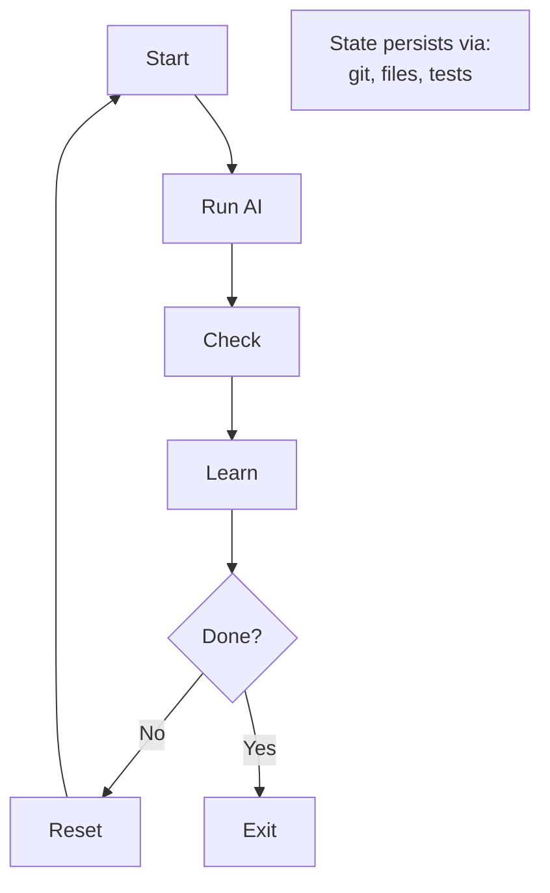

# [ralph](https://wiggum.dev)

<p align="center">
  <strong>AI-agnostic agentic loop CLI</strong>
  <br>
  Reset context. Persist learnings. Ship code.
</p>

<p align="center">
  <a href="#installation">Installation</a> •
  <a href="#quick-start">Quick Start</a> •
  <a href="#documentation">Documentation</a> •
  <a href="#why-ralph">Why Ralph?</a>
</p>

---

## What is ralph?

**ralph** runs AI coding agents in iterative loops. Instead of trying to one-shot prompts that hit context limits and get confused, ralph resets the context window between iterations while preserving the learning from each loop through your codebase.

```bash
ralph run -n 10 -p ./plans/PROMPT.md
```

The AI does work, commits changes, saves insights,exits, ralph checks if done, resets context, and loops—until your task is complete.

Full documentation can be found at [https://wiggum.dev](https://wiggum.dev).

## Why "Ralph Wiggum"?

The technique was coined by [Geoffrey Huntley](https://ghuntley.com/ralph/):

> "Ralph is a Bash loop."

Named after Ralph Wiggum from The Simpsons—embodying the philosophy of persistent iteration despite setbacks. *"Me fail English? That's unpossible!"*

## Installation

```bash
npm install -g @wiggumdev/ralph
```

You'll also need an AI CLI tool:

```bash
# Claude Code (recommended)
npm install -g @anthropic-ai/claude-code @agentclientprotocol/claude-agent-acp

# Or OpenCode
npm i -g opencode-ai

# Or GitHub Copilot CLI
npm install -g @github/copilot
```

### Supported Adapters

| Adapter | Status | ACP Command | Install |
|---------|--------|-------------|---------|
| Claude Code | Complete | `claude-agent-acp` | `@agentclientprotocol/claude-agent-acp` |
| OpenCode | Complete | `opencode acp` | `opencode-ai` |
| Gemini CLI | Under Development | `gemini --experimental-acp` | `@google/gemini-cli` |
| GitHub Copilot CLI | Complete | `copilot --acp` | `@github/copilot` |

All adapters communicate via ACP (Agent Client Protocol).

> **Note:** `@agentclientprotocol/claude-agent-acp` is the maintained Claude
> Code agent. It supersedes `@zed-industries/claude-code-acp`, which is
> deprecated — ralph still accepts its `claude-code-acp` binary if that is what
> you have installed. The unscoped `claude-code-acp` package on npm is an
> unrelated third-party project that installs `cc-acp` and is not supported.

## Quick Start

```bash
# Initialize in your project
cd your-project
ralph init

# Use your agent to generate a plan and write
zed .plans/prd.json

# Edit your prompt to your specific needs
zed .plans/PROMPT.md

# Run the loop
ralph run
```

## Features

- **Context Reset** — Fresh context window each iteration
- **State Persistence** — Progress via git, files, and tests
- **Completion Detection** — AI signals when done with `<promise>COMPLETE</promise>`
- **Lifecycle Hooks** — Run commands at key points in the loop

## How It Works



Each iteration:
1. AI starts with fresh context
2. Reads codebase to understand state
3. Does work (writes code, runs tests)
4. ralph checks for completion marker
5. If not done, reset and loop

## Configuration

ralph uses TOML config at `.ralph/config.toml`:

```toml
adapter = "claude"
maxIterations = 20
plansDir = ".plans"
debug = false
tui = true
yolo = false
transportLog = false

[hooks]
ralph_start = ""
ralph_loop_end = "npm run lint:fix"
ralph_complete = "say 'Ralph is done!'"
```

## Project Structure

After `ralph init`:

```
project/
├── .ralph/
│   └── config.toml      # Configuration
└── .plans/
    ├── prd.json         # Feature requirements
    ├── PROMPT.md        # Your ralph loop prompt
    └── progress.txt     # Learning log
```

## Commands

```bash
ralph init              # Initialize ralph in a project
ralph run               # Start the agentic loop
ralph check             # Validate prd.json schema
```

### Run Options

```bash
ralph run --max-iterations 10   # Limit iterations
ralph run --once                # Single iteration (no loop)
ralph run --prompt TASK.md      # Use specific prompt file
ralph run --debug               # Write debug log to file
ralph run --yolo                # Auto-approve all permissions
ralph run --transport-log       # Log raw ACP transport messages
```

## Loop Prompt Example

Your prompt in `.plans/PROMPT.md` should include:

```markdown
@.plans/prd.json @.plans/progress.txt

1. Find the highest-priority feature to work on and work ONLY on that feature. This should be the one YOU decide has the highest priority - not necessarily the first in the list

2. Before making changes, search codebase (don't assume not implemented).

3. Implement the requirements for the selected feature using TDD.

3. Run typecheck and tests: `bun run typecheck && bun run test`

4. Update prd.json marking completed work (CAREFULLY!)

**YOU CAN ONLY MODIFY ONE FIELD: "passes"**

After thorough verification, change:
\`\`\`json
"passes": false
\`\`\`
to:
\`\`\`json
"passes": true
\`\`\`

5. Append learning to .plans/progress.txt for future iterations.

6. Commit changes: `jj commit -m "description"`

ONLY WORK ON A SINGLE FEATURE PER ITERATION.

If all features complete, output <promise>COMPLETE</promise>

When you learn something new about how to run commands or patterns in the code make sure you update @CLAUDE.md using a subagent but keep it brief.

Remember: You have unlimited time across many sessions. Focus on quality over speed. Production-ready is the goal.
```

## Documentation

Full documentation at **[wiggum.dev](https://wiggum.dev)**

## Based On

- [The original Ralph concept](https://ghuntley.com/ralph/) by Geoffrey Huntley
- [Anthropic's research](https://www.anthropic.com/engineering/effective-harnesses-for-long-running-agents) on effective harnesses for long-running agents
- [Matt Pocock's explanation](https://youtu.be/_IK18goX4X8) of the technique

## License

MIT
