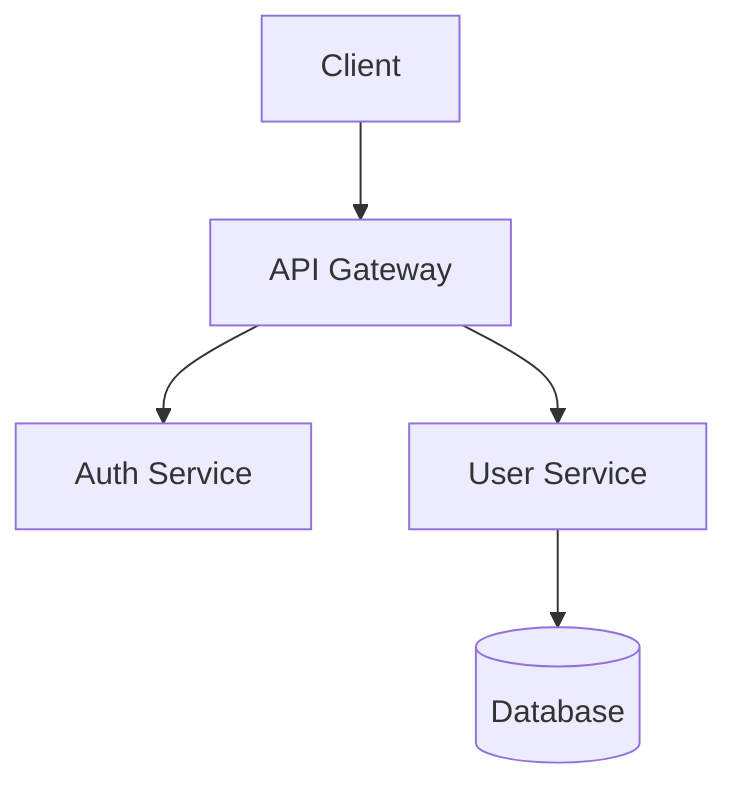

import { Aside } from '@astrojs/starlight/components';

# Documentation with ralph

Documentation is often neglected because it's tedious. ralph makes it systematic—iterate until everything is documented.

## Example: JSDoc Comments

Add JSDoc comments to all exported functions.

### Configuration

```json
{
  "tool": "claude",
  "exitConditions": {
    "command": "npx eslint src/ --rule 'jsdoc/require-jsdoc: error' 2>&1 | grep -c 'error'",
    "successPattern": "^0$",
    "maxIterations": 40
  }
}
```

### Prompt

```markdown
# Add JSDoc Documentation

Add JSDoc comments to all exported functions, classes, and types.

## JSDoc Format

### Functions
```typescript
/**
 * Brief description of what the function does.
 *
 * @param paramName - Description of parameter
 * @returns Description of return value
 * @throws {ErrorType} When this error occurs
 *
 * @example
 * ```typescript
 * const result = myFunction('input');
 * ```
 */
export function myFunction(paramName: string): ReturnType {
```

### Classes
```typescript
/**
 * Brief description of the class purpose.
 *
 * @example
 * ```typescript
 * const instance = new MyClass();
 * instance.doSomething();
 * ```
 */
export class MyClass {
```

### Types/Interfaces
```typescript
/**
 * Describes what this type represents.
 */
export interface MyInterface {
  /** Description of property */
  propertyName: string;
}
```

## Rules
- Document ALL exports (functions, classes, interfaces, types)
- Include @param for every parameter
- Include @returns for non-void functions
- Include @throws for functions that throw
- Include @example for complex functions
- Keep descriptions concise but complete

## Process
1. Run ESLint to find undocumented exports
2. Document one file at a time
3. Run ESLint again to verify
4. Commit: "docs(file): add JSDoc comments"

## Done When
`npx eslint src/ --rule 'jsdoc/require-jsdoc: error'` shows 0 errors.
```

## Example: README Generation

Generate README files for each package in a monorepo.

### Configuration

```json
{
  "tool": "claude",
  "exitConditions": {
    "command": "find packages -maxdepth 2 -name 'package.json' -exec dirname {} \\; | while read d; do [ -f \"$d/README.md\" ] || echo missing; done | grep -c missing",
    "successPattern": "^0$",
    "maxIterations": 20
  }
}
```

### Prompt

```markdown
# Generate Package READMEs

Create README.md files for each package in the monorepo.

## README Template

```markdown
# package-name

Brief description from package.json.

## Installation

\`\`\`bash
npm install package-name
\`\`\`

## Usage

\`\`\`typescript
import { mainExport } from 'package-name';

// Basic usage example
\`\`\`

## API

### `functionName(params): ReturnType`

Description of function.

**Parameters:**
- `param1` - Description

**Returns:** Description

**Example:**
\`\`\`typescript
// Example code
\`\`\`

## Configuration

If applicable, document configuration options.

## License

MIT
```

## Process
1. Find packages without README: `find packages -maxdepth 2 -name 'package.json' -exec dirname {} \;`
2. Read package.json and source code
3. Generate README following template
4. Commit: "docs(package): add README"

## Done When
Every package directory has a README.md.
```

## Example: API Documentation

Generate OpenAPI/Swagger documentation from code.

### Configuration

```json
{
  "tool": "claude",
  "exitConditions": {
    "command": "npm run docs:validate",
    "successExitCode": 0,
    "maxIterations": 30
  }
}
```

### Prompt

```markdown
# Generate API Documentation

Add OpenAPI annotations to all API routes.

## Annotation Format (using tsoa)

```typescript
/**
 * @summary Get user by ID
 * @param userId The user's unique identifier
 * @returns User object
 */
@Get('{userId}')
@Response<NotFoundError>(404, 'User not found')
@Response<ValidationError>(400, 'Invalid user ID')
public async getUser(
  @Path() userId: string
): Promise<User> {
```

## Documentation Requirements
- Every route must have @summary
- All parameters documented with @param
- Response types documented with @Response
- Error responses documented
- Request body types defined

## Process
1. Find undocumented routes
2. Add annotations
3. Run `npm run docs:generate`
4. Validate with `npm run docs:validate`
5. Commit

## Generated Output
API docs are generated to docs/api/openapi.json
```

## Example: Changelog Updates

Keep CHANGELOG.md updated from git commits.

### Prompt

```markdown
# Update Changelog

Update CHANGELOG.md based on recent commits.

## Changelog Format (Keep a Changelog)

```markdown
## [Unreleased]

### Added
- New features

### Changed
- Changes in existing functionality

### Deprecated
- Soon-to-be removed features

### Removed
- Removed features

### Fixed
- Bug fixes

### Security
- Security fixes
```

## Process
1. Read current CHANGELOG.md
2. Run `git log --oneline LAST_TAG..HEAD` to get new commits
3. Categorize commits by type (feat, fix, etc.)
4. Add entries to appropriate sections
5. Commit: "docs: update changelog"

## Commit Type Mapping
- `feat:` → Added
- `fix:` → Fixed
- `refactor:` → Changed
- `perf:` → Changed
- `security:` → Security
- `deprecated:` → Deprecated

## Done When
All commits since last tag are documented in CHANGELOG.md.
```

## Example: Architecture Documentation

Generate architecture documentation from code.

### Prompt

```markdown
# Generate Architecture Docs

Create architecture documentation based on code structure.

## Document Structure

Create `docs/architecture/` with:

### overview.md
- High-level system description
- Key design decisions
- Technology stack

### modules.md
- Description of each module/package
- Responsibilities
- Dependencies

### data-flow.md
- How data flows through the system
- Key integration points
- External services

### patterns.md
- Design patterns used
- Coding conventions
- Common utilities

## Process
1. Analyze project structure
2. Read key files (index.ts, main entry points)
3. Identify patterns and architecture
4. Generate documentation
5. Create diagrams (Mermaid syntax)

## Mermaid Diagram Example


## Done When
docs/architecture/ contains complete documentation.
```

## Tips for Documentation Tasks

### 1. Provide Examples

Include examples of good documentation:

```markdown
## Good JSDoc Example
[Include a well-documented function from your codebase]
```

### 2. Define Style Guidelines

Be explicit about style:

```markdown
## Style Guidelines
- Use present tense ("Returns" not "Will return")
- Start with verb ("Gets the user" not "This function gets")
- Keep first line under 80 characters
- Use @example for anything non-obvious
```

### 3. Include Validation

Give the AI a way to check its work:

```markdown
## Validation
Run `npm run lint:docs` to check documentation completeness.
```

### 4. Handle Edge Cases

Document how to handle tricky situations:

```markdown
## Edge Cases
- Private methods: Don't document unless complex
- Generated code: Skip files in src/generated/
- Deprecated functions: Include @deprecated tag
```

<Aside type="tip" title="Documentation Quality">
The AI will match the quality of examples you provide. If you want great documentation, include great examples in your prompt.
</Aside>
